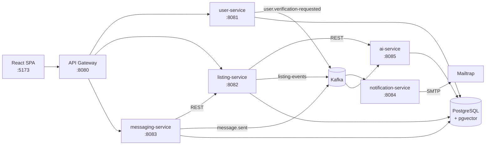

# Real Estate App

Web aplikacija za oglašavanje nekretnina (prodaja i izdavanje), urađena kao mikroservisni sistem
(Spring Boot / Spring Cloud) sa React frontendom i AI servisom za semantičku pretragu oglasa.

## Funkcionalnosti

- **Registracija i prijava**: JWT autentifikacija (access + refresh token) i verifikacija naloga preko emaila.
- **Oglasi**: kreiranje oglasa sa slikama, pregled, „moji oglasi“, filtrirana pretraga sa paginacijom.
- **Semantička pretraga**: upit na prirodnom jeziku (npr. *„mali stan za studenta blizu fakulteta“*). AI servis
  rangira oglase po značenju, ne po ključnim rečima.
- **Omiljeni oglasi i prijava neprikladnih oglasa**.
- **Administracija**: administrator pregleda prijave i odobrava ih (oglas se briše) ili odbija.
- **Poruke**: razgovori između zainteresovanog korisnika i vlasnika oglasa, blokiranje korisnika i email
  obaveštenje o novoj poruci (za sada stiže na test adresu `notification.test-recipient-email`).

Gosti mogu da pretražuju i pregledaju oglase. Za sve ostalo je potrebna prijava.

## Arhitektura



| Servis | Port | Uloga |
|---|---|---|
| `discovery-server` | 8761 | Eureka registar servisa |
| `configuration-server` | 8888 | Spring Cloud Config: centralna konfiguracija servisa (`config/*.properties`) |
| `api-gateway` | 8080 | Jedina ulazna tačka za frontend: rutiranje, provera JWT tokena, CORS |
| `user-service` | 8081 | Korisnici, registracija, prijava, verifikacija emaila, izdavanje JWT tokena |
| `listing-service` | 8082 | Oglasi, slike, omiljeni oglasi, prijave oglasa, pretraga |
| `messaging-service` | 8083 | Razgovori, poruke, blokirani korisnici |
| `notification-service` | 8084 | Čita Kafka događaje i šalje emailove (verifikacija, nova poruka) |
| `ai-service` | 8085 | Python/FastAPI: embedding oglasa (`intfloat/multilingual-e5-base`) i vektorska pretraga u pgvector-u |
| `postgres` | 5433 (host) | PostgreSQL 16 sa pgvector ekstenzijom, posebna baza za svaki servis |
| `kafka` | 9092 (host) | Asinhrona komunikacija između servisa (KRaft, bez ZooKeeper-a) |

**Kako teče zahtev:** frontend šalje sve zahteve na gateway (`/api/users/**`, `/api/listings/**`,
`/api/messagings/**`). Gateway proverava JWT, a zatim prosleđuje zahtev servisu koji pronalazi preko Eureke.
Svaki servis još jednom nezavisno proverava token.

**Semantička pretraga:** pri kreiranju i brisanju oglasa listing-service objavljuje događaj na topic
`listing-events`. ai-service ga čita, pravi tekstualni opis oglasa, računa embedding i čuva vektor u bazi.
Pri pretrazi listing-service šalje upit ai-service-u, dobija ID-jeve oglasa rangirane po sličnosti i na njih
primenjuje izabrane filtere.

### Tehnologije

- **Backend:** Java 17, Spring Boot 4, Spring Cloud (Gateway WebMVC, Config, Netflix Eureka), Spring Data JPA,
  Spring Security, jjwt, Spring Kafka, Lombok
- **AI servis:** Python 3.11, FastAPI, sentence-transformers (PyTorch CPU), SQLAlchemy, pgvector, aiokafka
- **Frontend:** React 19, TypeScript, Vite, React Router, Axios
- **Infrastruktura:** Docker Compose, PostgreSQL 16 + pgvector, Apache Kafka 3.8, Mailtrap (test SMTP)

## Pokretanje

### Preduslovi

- [Docker Desktop](https://www.docker.com/products/docker-desktop/) (ili Docker Engine sa Compose v2).
  Preporučeno je da Docker ima bar 6–8 GB RAM-a.
- [Node.js](https://nodejs.org/) 20+ za frontend
- Besplatan [Mailtrap](https://mailtrap.io/) nalog. Email Sandbox služi kao test inbox, pa se nijedan email ne
  šalje stvarnim primaocima.

### 1. Konfiguracija tajnih podataka

Lozinke i ključevi se ne nalaze u repozitorijumu. Čitaju se iz `.env` fajla u korenu projekta:

```bash
cp .env.example .env
```

Zatim popuniti vrednosti u `.env`:

| Promenljiva | Opis |
|---|---|
| `POSTGRES_PASSWORD` | Lozinka za PostgreSQL. Važi samo pri prvom kreiranju volumena baze. |
| `JWT_SECRET` | Base64 HMAC ključ, najmanje 256 bita. Može se generisati sa `openssl rand -base64 64`. |
| `MAIL_USERNAME`, `MAIL_PASSWORD` | Mailtrap → *Sandboxes* → *Integration* → *SMTP* |

Docker Compose automatski čita `.env` i prosleđuje vrednosti kontejnerima. U konfiguraciji servisa
(`configuration-server/src/main/resources/config/*.properties`, `api-gateway/.../application.yml`) stoje
samo placeholderi kao što su `${JWT_SECRET}`.

### 2. Pokretanje backend-a (Docker)

```bash
docker compose up --build
```

Ova komanda podiže PostgreSQL, Kafku i svih 8 servisa. Redosled pokretanja obezbeđuju healthcheck-ovi:
discovery → config → poslovni servisi.

> Prva izgradnja traje duže (nekoliko minuta) jer se preuzimaju Maven zavisnosti, PyTorch i embedding model
> (~1 GB). Model se ugrađuje u sliku pri izgradnji, pa ai-service posle toga ne zahteva pristup internetu.
> Pri pokretanju ai-service-u treba oko minut da učita model.

Stanje servisa može se pratiti na Eureka kontrolnoj tabli: <http://localhost:8761>.

### 3. Pokretanje frontend-a

Frontend se ne pokreće u Docker-u:

```bash
cd frontend
npm install
npm run dev
```

Aplikacija je dostupna na <http://localhost:5173>. Adresa API-ja se podešava u `frontend/.env`
(`VITE_API_BASE_URL`, podrazumevano `http://localhost:8080/api`).

### 4. Prvi koraci

1. **Registracija:** posle registracije stiže email sa linkom za verifikaciju. Email se vidi u Mailtrap inboxu.
   Klikom na link nalog se aktivira i može se prijaviti.
2. **Administrator:** svaki registrovani korisnik dobija ulogu `USER`. Za pristup stranici `/admin/reports`
   uloga se menja direktno u bazi, a zatim se treba ponovo prijaviti:

   ```bash
   docker exec -it postgres psql -U postgres -d user_service_db -c "UPDATE users SET role = 'ADMIN' WHERE email = 'admin@example.com';"
   ```

3. **Demo oglasi (opciono):** skripta `scripts/seed-listings.mjs` kreira demo oglase preko API-ja, pa se oni
   odmah indeksiraju i za semantičku pretragu. Slike nisu deo repozitorijuma. Treba ih staviti u
   `scripts/seed-images/` (nazivi fajlova su navedeni u skripti) ili proslediti putanju do foldera:

   ```bash
   node scripts/seed-listings.mjs "putanja/do/slika"
   ```

   Email i lozinka verifikovanog naloga unose se interaktivno ili preko `SEED_EMAIL` / `SEED_PASSWORD`.

### Zaustavljanje i reset

```bash
docker compose down        # zaustavlja kontejnere, podaci ostaju u volumenima
docker compose down -v     # briše i volumene (baze, Kafka, slike oglasa)
```

Skripte iz `postgres-init/` (kreiranje baza i pgvector ekstenzije) izvršavaju se samo nad praznim volumenom.
Posle njihove izmene ili promene `POSTGRES_PASSWORD` potrebno je pokrenuti `docker compose down -v`.

## Razvoj bez Docker-a (iz IDE-a)

Moguće je podići samo infrastrukturu u Docker-u, a servise pokretati lokalno:

```bash
docker compose up postgres kafka
```

- Servise treba pokretati redom: `discovery-server`, `configuration-server`, pa ostale. Svaki servis je
  zaseban Maven projekat (u njegovom direktorijumu: `./mvnw spring-boot:run`).
- Servisima treba proslediti promenljive okruženja iz `.env`: `JWT_SECRET` (gateway, user-, listing- i
  messaging-service), `POSTGRES_PASSWORD` (user-, listing- i messaging-service), `MAIL_USERNAME` i
  `MAIL_PASSWORD` (notification-service). U IntelliJ-u se to radi kroz *Run Configuration → Environment variables*.
- Podrazumevane adrese u config-server fajlovima su `localhost`. PostgreSQL iz Docker-a je na hostu na portu
  **5433**, pa ga treba zadati preko `SPRING_DATASOURCE_URL` ako na 5432 ne radi lokalni PostgreSQL.
- ai-service:

  ```bash
  cd ai-service
  cp .env.example .env    # upisati lozinku baze u DATABASE_URL
  python -m venv .venv && source .venv/bin/activate
  pip install -r requirements.txt
  uvicorn app.main:app --port 8085
  ```

## Struktura projekta

```
├── api-gateway/            Spring Cloud Gateway (rute, JWT filter, CORS)
├── discovery-server/       Eureka server
├── configuration-server/   Config server; config/<servis>.properties
├── user-service/           ┐
├── listing-service/        │ poslovni servisi: controller / service / repository /
├── messaging-service/      │ entity / dto / mapper / exception / security
├── notification-service/   ┘
├── ai-service/             FastAPI servis za embedding i semantičku pretragu
├── frontend/               React + TypeScript (Vite)
├── postgres-init/          SQL skripte za inicijalizaciju baza
├── scripts/                Skripta za demo podatke
├── docker-compose.yml
└── .env.example            Šablon za tajne podatke
```
